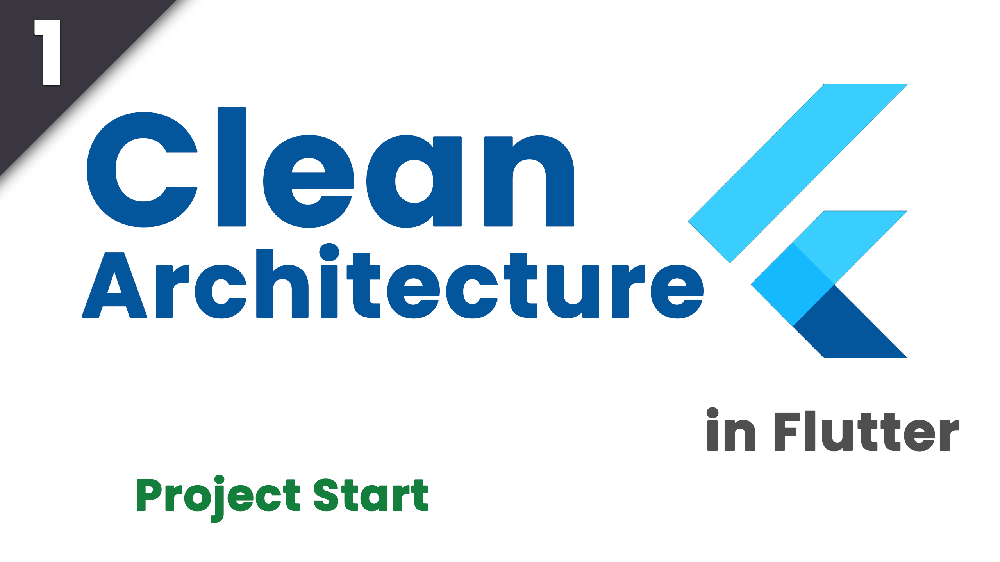

# Hours tracker app done with clean Architecture

This app is currently being developed for the CLean Architecture with BLoC youtube series.

YouTube Playlist: https://www.youtube.com/playlist?list=PLfGgPtWUXUJIwzPyJOQt3GrC-kLcpjcus

# Episodes (You can click on the images to go to the video)
<table>
  <tbody>
    <tr>
      <td class="img-container" width="30%">
        
      </td>
      <td class="content-container">
        

This episode contains the setup of the project and some base UI.

      </td>
    </tr>
    <tr>
      <td class="img-container" width="30%">
        
      </td>
      <td class="content-container">
        

I added Routes with Sailor and decided on the flow of the app.

      </td>
    </tr>
    <tr>
      <td class="img-container" width="30%">
        
      </td>
      <td class="content-container">
        

Added Firebase real time data using BLoC.

      </td>
    </tr>
  </tbody>
</table>
