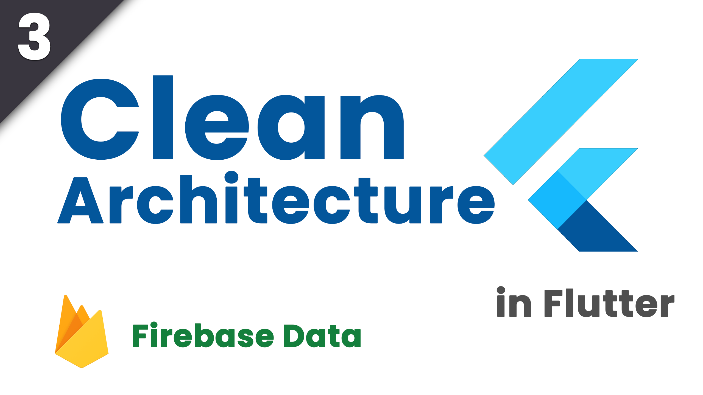

# Hours tracker app done with clean Architecture

This app is currently being developed for the CLean Architecture with BLoC youtube series.

YouTube Playlist: https://www.youtube.com/playlist?list=PLfGgPtWUXUJIwzPyJOQt3GrC-kLcpjcus

# Episodes (You can click on the images to go to the video)
<table>
  <tbody>
    <tr>
      <td class="img-container" width="30%">
        
      </td>
      <td class="content-container">
        

This is my first development video I've done, showing my experience and thinking process of implementing a new project from scratch with "clean" architecture and code. This project is fairly simple, but all the concepts used in this project are usable in any project of any scale, since we are using BLoC as a state management. 

      </td>
    </tr>
    <tr>
      <td class="img-container" width="30%">
        
      </td>
      <td class="content-container">
        

I've explained what exactly this project is about and then implemented routing with Sailor and changed the authentication flow.
*Regarding the NeverScrollablePhysics: you shouldn't actually add that because if your elements need more space than the space you have when you open your keyboard, some of them will remain under the keyboard and you won't be able to scroll to them, so leaving scrolling physics on is a must in that case.

      </td>
    </tr>
    <tr>
      <td class="img-container" width="30%">
        
      </td>
      <td class="content-container">
        

In this episode I added real time data with firebase and bloc to support multiple platforms in the future. Please don't mind the design, it doesn't matter that much at this point in development as I'm focusing on making things work, since design is the easiest part to do when I get everything else done. For the next episode, I will focus on adding local database with HIVE, as suggested by SAMIUL ALIM in the first episode.

      </td>
    </tr>
  </tbody>
</table>
